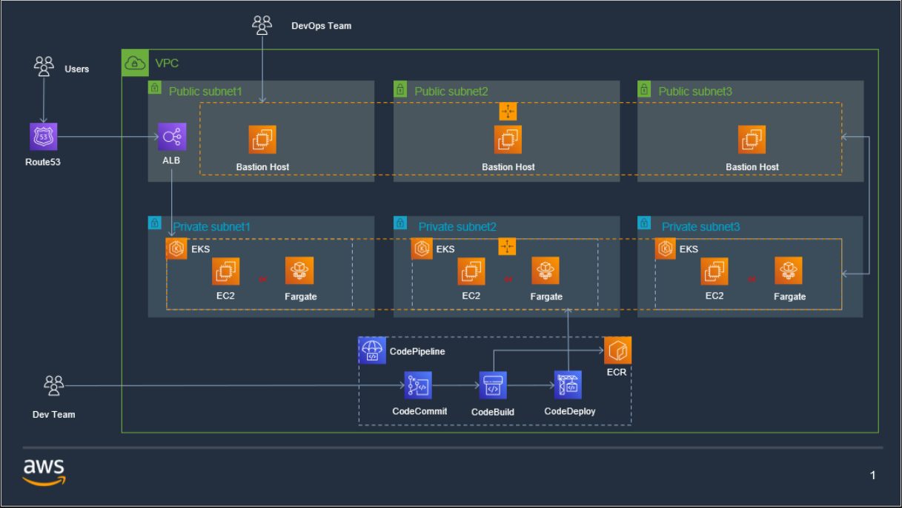

# kakao-mobility

</br>

## <strong style="color: rgb(252, 186, 3);">First of Assignment</strong>

---

Aside from RDB, S3, etc, I focused entirely on building a Kubernetes environment.

</br>

### <strong style="color: rgb(252, 186, 3);">Public cloud used</strong>

AWS

</br>

### <strong style="color: rgb(252, 186, 3);">Resources Required for Infrastructure Configuration</strong>

```txt
# IAM
# VPC
# Rout53
# ALB
# EKS
```

</br>

### <strong style="color: rgb(252, 186, 3);">Infrastructure diagram</strong>



</br></br>

### <strong style="color: rgb(252, 186, 3);">Process</strong>

</br>

**[Excute Environments]**

```txt
# Terrafrom v1.0.1
# AWS Cli v1.18.69
# Kubernetes Client v1.21.2
# AWS-IAM-Authenticator v0.5.0
```

</br>

**[Precondition]**

```txt
1. Create AWS Account
2. Set MFA
3. Add user
4. Grant a role
5. Create AWS Access Key ID and Secret Access Key
6. AWS config settings
7. EKS environment setting with terraform(proceed from this part!!!)
```

</br>

**[Excluded service]**  
The following services have been excluded due to cost.

```txt
# NAT-Gateway
# Rout53
# ALB
# EKS
```

</br>

**[Description of terraform files]**

```txt
# versions.tf
Specifies the required provider version and required Terraform version

# vpc.tf
Provisions a VPC, subnets and availability zones.

# security-groups.tf
Provisions the security groups used by the EKS cluster.

# outputs.tf
Defines the output configuration.
```

</br>

**Terraform TEST**

```bash
cd Assignment01

# Initialize Terraform workspace
terraform init

# Provision
terraform apply

# Clean up workspace
terraform destroy
```

</br>

### <strong style="color: rgb(252, 186, 3);">Reference</strong>

[A vagrant project with an ubuntu box with the tools needed to do DevOps](https://github.com/Finfra/terraform_quickstart)

[Setting up AWS EKS (Hosted Kubernetes)](https://github.com/Finfra/terraform-course/tree/master/c1-EKS)

[Auto Deploymemnt of EKS Infrastructure on AWS with Terraform](https://github.com/reddypidugu/aws)

[Provision an EKS Cluster (AWS)](https://learn.hashicorp.com/tutorials/terraform/eks)

[Amazon Elastic Kubernetes Service (Amazon EKS) Architecture Explained with Diagram](https://www.devopsschool.com/blog/amazon-elastic-kubernetes-service-amazon-eks-architecture-explained-with-diagram/)

[Terraform 0.13으로 테라폼 코드 업그레이드하기](https://blog.outsider.ne.kr/1516)

</br></br>

## <strong style="color: rgb(252, 186, 3);">Second of Assignment</strong>

---

I deploy a web container to a Kubernetes environment using **"kind"** in my local environment.

</br>

### <strong style="color: rgb(252, 186, 3);">Process</strong>

</br>

**[Excute Environments]**

```txt
# Ubuntu 20.04.1 LTS
# Node v10.16.3
# NPM v7.6.0
# Docker v19.03.8
# Kubernetes Client v1.21.2
# Kind v0.8.1
```

</br>

**1. Source TEST**

```bash
cd Assignment02

# Install package
npm install

# Start to server
node index.js

# Test
curl http://localhost:8080
```

</br>

**2. Unit TEST**

```bash
cd Assignment02


# Set up a local Kubernetes cluster
## 1. Grant execution permission
chmod +x scripts/kind-with-registry.sh

## 2. Run the cluster using the local registry
scripts/kind-with-registry.sh


# Create and upload docker images
# 1. Build image
docker build -t localhost:5000/assignment02:latest -f ./Dockerfile.prod .

# 2. Excute container(Options)
docker run -p 8080:8080 --name web-service localhost:5000/assignment02:latest

# 3. Upload image
docker push localhost:5000/assignment02:latest


# Deploy to Kubernetes
## 1. Deploy the nginx docker container and run ia as a process on the cluster
kubectl apply -f manifests/5_deploy_using_local_registry.yaml

## 2. Confirm the pod is running
kubectl get pods
kubectl logs "name of pods"

## 3. Expose the service
kubectl apply -f manifests/6_service_using_local_registry.yaml

## 4. Confirm the service is running
kubectl get services

## 5. set it in a browser(http://localhost)

## 6. Clean up new cluster
kind delete cluster --name mycluster
```

</br>

**3. Build**

```bash
## Private docker registry must be running. Otherwise, run the following command first.
## Set up a local Kubernetes cluster
##
## 1. Grant execution permission
##    chmod +x scripts/kind-with-registry.sh
##
## 2. Run the cluster using the local registry
##    scripts/kind-with-registry.sh


# Grant execution permission
chmod +x scripts/build.sh

# Excute
scripts/build.sh
```

</br>

**4. Deploy**

```bash
## Kind (local Kubernetes) must be running. Otherwise, run the following command first.
## Set up a local Kubernetes cluster
##
## 1. Grant execution permission
##    chmod +x scripts/kind-with-registry.sh
##
## 2. Run the cluster using the local registry
##    scripts/kind-with-registry.sh

# Grant execution permission
chmod +x scripts/deploy.sh

# Excute
scripts/deploy.sh

# Test
## Check in browser(http://localhost)
## or 
curl http://localhost
```

</br>

### <strong style="color: rgb(252, 186, 3);">Reference</strong>

[Tutorial: Deploy Your First Kubernetes Cluster](https://www.appvia.io/blog/tutorial-deploy-kubernetes-cluster#174e18c2-f22e-49fc-b5f3-2ffd2acc489e)

[https://twofootdog.tistory.com/73](https://twofootdog.tistory.com/73)

[kind](https://kind.sigs.k8s.io/)

[Your Intro Guide to Kubernetes](https://www.appvia.io/blog/intro-guide-to-kubernetes)

[AWS EKS에서 CodePipeline을 활용한 스프링부트 서비스 배포](https://twofootdog.tistory.com/73)
